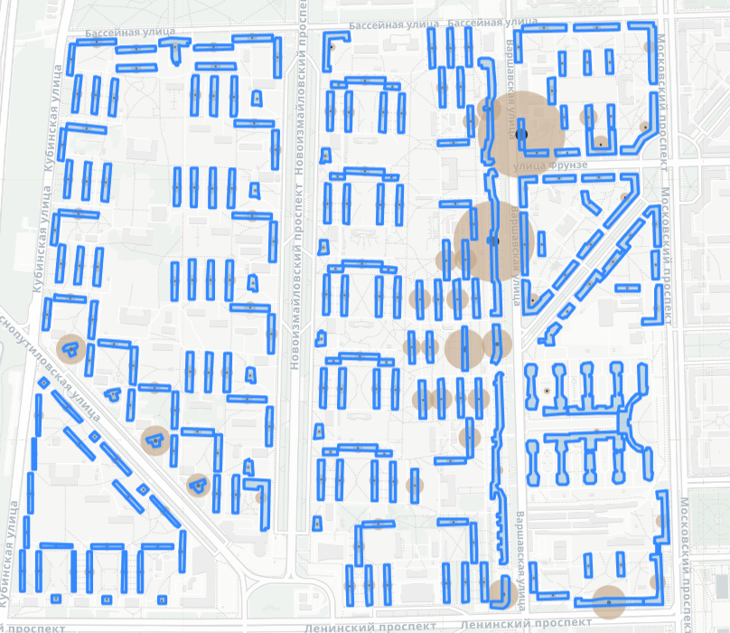

# Метод интеграции инфраструктуры для средств микромобильности в городскую среду

## Описание
Представленный метод предназначен для анализа обеспеченности городской среды инфраструктурой для микромобильности и расчёта минимально необходимого количества парковочных и зарядных мест для СИМ. 

Состоит из 6 разделов (в Jupyter Notebook):
- загрузка модулей (загрузка всех необходимых библиотек и модулей для работы кода);
- жилые здания (обработка слоя с жилыми зданиями);
- сервисы по площади (обработка слоя со следующими сервисами: бизнес-центры, торговые центры);
- сервисы по вместимости (обработка слоя со следующими сервисами: школы, медецинские учреждения, культурно-досуговые центры);
- остановки наземного транспорта (автомотическое проверка и/или добавление данных об инфраструктуре для СИМ в атрибутивную таблицу);
- станции метро (автомотическое проверка и/или добавление данных об инфраструктуре для СИМ в атрибутивную таблицу).

**Этапы:**
- загрузка источника данных (собственный файл или данные из OpenStreetMap) для сервисов:
  1. жилых зданий (осущетсвляется отдельно);
  2. сервисов по площади (осущетсвляется отдельно);
  3. сервисы по вместимости (осущетсвляется отдельно); 
  4. остановки наземного транспорта (осущетсвляется отдельно);
  5. станции метро (осущетсвляется отдельно);
- анализ обеспеченности городской среды инфраструктурой для микромобильности;
- расчёт минимально необходимого количества парковочных мест и зарядных мест для сервиса;
- подготовка данных к расчёту (в случае работы с данными из OpenStreetMap);
- расчёт минимально необходимого количества парковочных мест и зарядных мест для сервиса;
- сохранение полученного слоя в файл формата geojson;
- создание веб-карты полученного слоя с настраивыми параметрами отображения;
- сохранение полученной карты в формате html.
  
## Основные библиотеки
- **pandas**: обработка и анализ табличных данных.
- **osmnx**: работа сс данными из OpenStreetMap.
- **geopandas**: обработка геопространственных данных.
- **matplotlib**: визуализация данных.
- **blocksnet**: продвинутые методы анализа пространственных данных, включая доступность и центральность.
- **folium**: визуализация картографических данных.

## Использование метода:

### 1. Подготовка к использованию метода
Метод позволяет работать как с собственным файлом, так и с данными из OpenStreetMap. 

Выберете внутри разделов (сервисы по площади и сервисы по вместимости) конкртные серисы:
- для сервисов по площади доступны: бизнес-центры, торговые центры;
- для сервисов по вместимости доступны: школы, медецинские учреждения, культурно-досуговые центры.

По умолчанию в коде прописаны бизнес-центры и школы соответсвенно. 

Внутри кода имеются текстовые сноски с написанной частью кода, на которую небходимо заменить для работы с другими сервисами из списка. Кроме того, в коде имеются сноски и рекомендации по замене наименований переменных для корректной работы кода.

**Важно!**

**Работа с собственным файлом:**

При работе с собственным файлом (в формате geojson) важно наличие следующих столбцов в атрибутивной таблице геослоя:
 - для **жилых зданий**: парковочные_места_СИМ, зарядные_места_СИМ, количество_квартир, addr:housenumber, addr:street;
 - для **сервисов по площади**: парковочные_места_СИМ, зарядные_места_СИМ, Площадь, addr:housenumber, addr:street;
 - для **сервисов по вместимости**: парковочные_места_СИМ, зарядные_места_СИМ, Вместимость, addr:housenumber, addr:street, name;
 - для **остановок наземного транспорта**: парковочные_места_СИМ, зарядные_места_СИМ;
 - для **станций метро**: парковочные_места_СИМ, зарядные_места_СИМ.

Для корректной работы метода и увеличения точноти расчётов рекомендуется брать данные о количестве квартир, площади и вместимости из надежных и открытых источников.

Все столбцы с атрибутами объектов должны быть заполнены, пропуски или нулевые значения допускаются только в столбцах: парковочные_места_СИМ, зарядные_места_СИМ.

Информация об атрибутах: addr:housenumber, addr:street, name есть в OpenStreetMap.

**Работа с данными из OpenStreetMap:**

При выгрузке данных из OpenStreetMap важно корректно указать наименование территории. Дополнительная работа с данными из OSM не требуется, неободимые преобразования данных предусмотрены в коде. Важно отметить, что данные из OSM не обладают высокой точностью, в связи с чем в полученных данным могут быть неточности.

### 2. Загрузка данных
Загрузка данных конкретного сервиса одним из способов, проверка загруженных данных в виде атрибутивной таблицы и в виде карты.

### 3. Метод
Активация основной функции (для каждого сервиса своя), применение функции на данных, вывод атрибутивной таблицы с полученными данными.

### 4. Сохранение файла
Файл сохраняется в формате geojson

### 5. Визуализация
Построение картографическое визуализацией с настраивым отображением.Карта содержит три слоя (информация о сервисе(настраиваемая, можно заменить по усмотрению), о парковочных местах для СИМ и зарядных местах для СИМ)

Пример для жилых домов:

### 6. Сохранение карты
Сохранение веб-карты в формате html.

## Структура репозитория
- **Jupyter Notebook**(Method): основной файл с кодом для использования метода.
- **Данные**(data): пример входных и выходных данных жилых зданий, сервисов по площади, сервисов по вместимости.
- **Документы**(docs): примеры полученных карт.
- **README**: описание репозитория и метода.
- Другие файлы описывают технические требования для работы с кодом.

## Действия
1. Установите зависимости из `requirements.txt`.
2. Откройте Jupyter Notebook для выполнения анализа.
3. Следуйте инструкциям из Readme (Использование метода) и Jupyter Notebook для реализации метода на своей территории.

## Авторство
Исследование проведено в рамках научно-исследовательской работы Института Дизайна и Урбанистики Университета ИТМО.

Студентка: Станкова Алёна Владимировна.

Научный руководитель: Воронин Данил Валерьевич, старший преподаватель Института дизайна 
и урбанистики (Университет ИТМО).

## Лицензия
Данный проект распространяется под свободной лицензией. Используйте материалы в образовательных и исследовательских целях.
